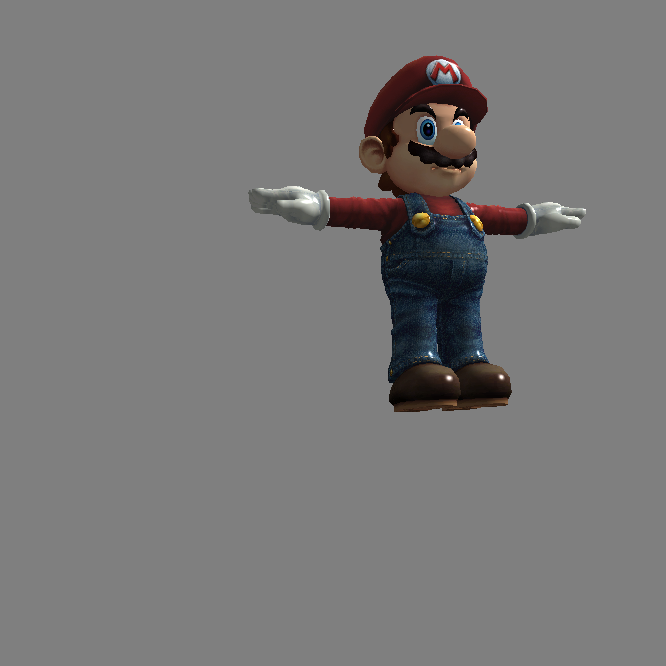

# Rasterizer Document
主要代码位置: `assignment_package/cis560_rasterizer_3d` 

## 实现过程
### 1 凸多边形分割
函数`Polygon::Triangulate()`实现凸多边形分割
### 2 Segment线段类
实现`Segment`线段类（位于`polygon.h`中），Segment使用两个端点代表一个线段，也是三角形的一条边。
Segment类中`Segment::getIntersection`函数用于判断一条水平线与线段是否有交点，如有则返回交点的横坐标，
用于后续x扫描线算法。
### 3 包围盒计算
`Rasterizer::getBoundingBox`函数用于计算一个三角形的包围盒
### 4 三角形渲染
`Rasterizer::renderTriangular`函数用于实现单个三角形在的渲染，首先进行背面剔除，除去背面看不见的三角形；然后获取三角形的包围盒并clip掉屏幕之外的部分；接着通过`Rasterizer::getLeftAndRightIntersectionX`函数运用扫描线算法计算出包围盒中每个y与三角形的左右交点，最后对左右交点内点的frag进行通过重心插值和利用深度缓冲决定是否对pixel上色

**到此为止，可以实现2d的三角形渲染** , 渲染结果详见2D_result文件夹

### 5 交互式摄像机控制
在Camera类中，`Camera::getViewMatrix()`类用于获取View Matrix，`Camera::getProjrctionMatrix()`用于获取Projection Matrix。同时，Camera类还实现了虚拟摄像机的移动、绕坐标轴旋转等功能。

### 6 纹理映射
`Rasterizer::interpolate`函数中实现位置、法线、颜色的插值以及纹理映射。

### 7 Blinn-Phong反射模型
`Rasterizer::reflectionColor`函数实现了Blinn-Phong反射模型。

**到此位置，可以实现三维的渲染**，渲染结果见3D_result

